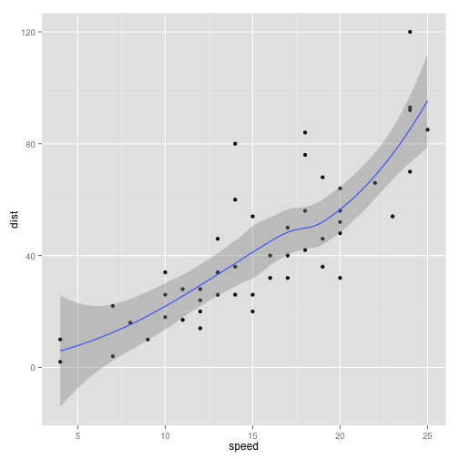

## What is R?

> 1. Functional programming language
> 2. Statistical and data mining tool
> 3. Data Visualisation tool
> 4. Presentation tool (Knitr, Slides, Pdf, Html, ...)
> 5. Much more (munging, transformation, sampling, ...)

--- .class #id 

## Pros
> 1. Free, open source, avaliable on major platforms
> 2. Massive set of packages for statistical modeling, machine learning, ...
> 3. Fantastic community (mailing lists, stackoverflow, BURN, ...)
> 4. Powerful tools for communicating the results, html, reports, interactive websites...
> 5. Strong foundation in functioanal proramming
> 6. Powerful IDE for interactive data analysis and statistical programming
> 7. Designed to connect to high-performance programming languages like C++ 
> 8. "Everything" integrated and easy to use => quick results

---

## Cons

> 1. Most R users are not programmers (code is not very elegant, fast or easy to understand)
> 2. Focus on result instead of process (lack of VCS, TDD)
> 3. Inconsistency is rife across contributed packages, even within base R (20 years)
> 4. Many special cases
> 5. R is not fast, easy to write terribly slow code with profligate memory usage
> 6. All the above is a challenge for us

---

## Example: Simple Correlation 


```r
library(ggplot2)
qplot(speed, dist, data = cars) + geom_smooth()
```

 

---

## Example: Con - read.table
Readability, speed, hidden features (first column), ...

```r
read.table <- function (file, header = FALSE, sep = "", quote = "\"'", dec = ".", 
  row.names, col.names, as.is = !stringsAsFactors, na.strings = "NA", 
  colClasses = NA, nrows = -1, skip = 0, check.names = TRUE, 
  fill = !blank.lines.skip, strip.white = FALSE, blank.lines.skip = TRUE, 
  comment.char = "#", allowEscapes = FALSE, flush = FALSE, 
  stringsAsFactors = default.stringsAsFactors(), fileEncoding = "", 
  encoding = "unknown", text, skipNul = FALSE) 
{
  if (missing(file) && !missing(text)) {
    file <- textConnection(text, encoding = "UTF-8")
    encoding <- "UTF-8"
    on.exit(close(file))
  }
  if (is.character(file)) {
    file <- if (nzchar(fileEncoding)) 
      file(file, "rt", encoding = fileEncoding)
    else file(file, "rt")
    on.exit(close(file))
  }}
```

---

## Example: GoogleVis a more complex example
<!-- GeoChart generated in R 3.1.0 by googleVis 0.5.2 package -->
<!-- Fri Jun 13 08:15:57 2014 -->


<!-- jsHeader -->
<script type="text/javascript">
 
// jsData 
function gvisDatac1 () {
var data = new google.visualization.DataTable();
var datajson =
[
 [
 "Germany",
3 
],
[
 "Brazil",
4 
],
[
 "United States",
5 
],
[
 "France",
4 
],
[
 "Hungary",
3 
],
[
 "India",
2 
],
[
 "Iceland",
1 
],
[
 "Norway",
4 
],
[
 "Spain",
5 
],
[
 "Turkey",
1 
] 
];
data.addColumn('string','Country');
data.addColumn('number','Profit');
data.addRows(datajson);
return(data);
}


// jsData 
function gvisDatac2 () {
var data = new google.visualization.DataTable();
var datajson =
[
 [
 "Germany",
3 
],
[
 "Brazil",
4 
],
[
 "United States",
5 
],
[
 "France",
4 
],
[
 "Hungary",
3 
],
[
 "India",
2 
],
[
 "Iceland",
1 
],
[
 "Norway",
4 
],
[
 "Spain",
5 
],
[
 "Turkey",
1 
] 
];
data.addColumn('string','Country');
data.addColumn('number','Profit');
data.addRows(datajson);
return(data);
}


// jsData 
function gvisDatac3 () {
var data = new google.visualization.DataTable();
var datajson =
[
 [
 "Global",
null,
10,
2 
],
[
 "America",
"Global",
2,
4 
],
[
 "Europe",
"Global",
99,
11 
],
[
 "Asia",
"Global",
10,
8 
],
[
 "France",
"Europe",
71,
2 
],
[
 "Sweden",
"Europe",
89,
3 
],
[
 "Germany",
"Europe",
58,
10 
],
[
 "Mexico",
"America",
2,
9 
],
[
 "USA",
"America",
38,
11 
],
[
 "China",
"Asia",
5,
1 
],
[
 "Japan",
"Asia",
48,
11 
] 
];
data.addColumn('string','Region');
data.addColumn('string','Parent');
data.addColumn('number','Val');
data.addColumn('number','Fac');
data.addRows(datajson);
return(data);
}
 
// jsDrawChart
function drawChartc1() {
var data = gvisDatac1();
var options = {};
options["width"] =    250;
options["height"] =    120;

    var chart = new google.visualization.GeoChart(
    document.getElementById('c1')
    );
    chart.draw(data,options);
    

}
  


// jsDrawChart
function drawChartc2() {
var data = gvisDatac2();
var options = {};
options["allowHtml"] = true;
options["width"] =    250;
options["height"] =    260;
options["legend"] = "none";

    var chart = new google.visualization.BarChart(
    document.getElementById('c2')
    );
    chart.draw(data,options);
    

}
  


// jsDrawChart
function drawChartc3() {
var data = gvisDatac3();
var options = {};
options["width"] =    400;
options["height"] =    380;
options["fontSize"] =     16;
options["minColor"] = "#EDF8FB";
options["midColor"] = "#66C2A4";
options["maxColor"] = "#006D2C";
options["headerHeight"] =     20;
options["fontColor"] = "black";
options["showScale"] = true;

    var chart = new google.visualization.TreeMap(
    document.getElementById('c3')
    );
    chart.draw(data,options);
    

}
  
 
// jsDisplayChart
(function() {
var pkgs = window.__gvisPackages = window.__gvisPackages || [];
var callbacks = window.__gvisCallbacks = window.__gvisCallbacks || [];
var chartid = "geochart";
  
// Manually see if chartid is in pkgs (not all browsers support Array.indexOf)
var i, newPackage = true;
for (i = 0; newPackage && i < pkgs.length; i++) {
if (pkgs[i] === chartid)
newPackage = false;
}
if (newPackage)
  pkgs.push(chartid);
  
// Add the drawChart function to the global list of callbacks
callbacks.push(drawChartc1);
})();
function displayChartc1() {
  var pkgs = window.__gvisPackages = window.__gvisPackages || [];
  var callbacks = window.__gvisCallbacks = window.__gvisCallbacks || [];
  window.clearTimeout(window.__gvisLoad);
  // The timeout is set to 100 because otherwise the container div we are
  // targeting might not be part of the document yet
  window.__gvisLoad = setTimeout(function() {
  var pkgCount = pkgs.length;
  google.load("visualization", "1", { packages:pkgs, callback: function() {
  if (pkgCount != pkgs.length) {
  // Race condition where another setTimeout call snuck in after us; if
  // that call added a package, we must not shift its callback
  return;
}
while (callbacks.length > 0)
callbacks.shift()();
} });
}, 100);
}


// jsDisplayChart
(function() {
var pkgs = window.__gvisPackages = window.__gvisPackages || [];
var callbacks = window.__gvisCallbacks = window.__gvisCallbacks || [];
var chartid = "corechart";
  
// Manually see if chartid is in pkgs (not all browsers support Array.indexOf)
var i, newPackage = true;
for (i = 0; newPackage && i < pkgs.length; i++) {
if (pkgs[i] === chartid)
newPackage = false;
}
if (newPackage)
  pkgs.push(chartid);
  
// Add the drawChart function to the global list of callbacks
callbacks.push(drawChartc2);
})();
function displayChartc2() {
  var pkgs = window.__gvisPackages = window.__gvisPackages || [];
  var callbacks = window.__gvisCallbacks = window.__gvisCallbacks || [];
  window.clearTimeout(window.__gvisLoad);
  // The timeout is set to 100 because otherwise the container div we are
  // targeting might not be part of the document yet
  window.__gvisLoad = setTimeout(function() {
  var pkgCount = pkgs.length;
  google.load("visualization", "1", { packages:pkgs, callback: function() {
  if (pkgCount != pkgs.length) {
  // Race condition where another setTimeout call snuck in after us; if
  // that call added a package, we must not shift its callback
  return;
}
while (callbacks.length > 0)
callbacks.shift()();
} });
}, 100);
}


// jsDisplayChart
(function() {
var pkgs = window.__gvisPackages = window.__gvisPackages || [];
var callbacks = window.__gvisCallbacks = window.__gvisCallbacks || [];
var chartid = "treemap";
  
// Manually see if chartid is in pkgs (not all browsers support Array.indexOf)
var i, newPackage = true;
for (i = 0; newPackage && i < pkgs.length; i++) {
if (pkgs[i] === chartid)
newPackage = false;
}
if (newPackage)
  pkgs.push(chartid);
  
// Add the drawChart function to the global list of callbacks
callbacks.push(drawChartc3);
})();
function displayChartc3() {
  var pkgs = window.__gvisPackages = window.__gvisPackages || [];
  var callbacks = window.__gvisCallbacks = window.__gvisCallbacks || [];
  window.clearTimeout(window.__gvisLoad);
  // The timeout is set to 100 because otherwise the container div we are
  // targeting might not be part of the document yet
  window.__gvisLoad = setTimeout(function() {
  var pkgCount = pkgs.length;
  google.load("visualization", "1", { packages:pkgs, callback: function() {
  if (pkgCount != pkgs.length) {
  // Race condition where another setTimeout call snuck in after us; if
  // that call added a package, we must not shift its callback
  return;
}
while (callbacks.length > 0)
callbacks.shift()();
} });
}, 100);
}
 
// jsFooter
</script>
 
<!-- jsChart -->  
<script type="text/javascript" src="https://www.google.com/jsapi?callback=displayChartc1"></script>


<!-- jsChart -->  
<script type="text/javascript" src="https://www.google.com/jsapi?callback=displayChartc2"></script>


<!-- jsChart -->  
<script type="text/javascript" src="https://www.google.com/jsapi?callback=displayChartc3"></script>
 
<table cellspacing=5>
<tr>
<td>

<table border="0">
<tr>
<td>

<!-- divChart -->
  
<div id="c1"
  style="width: 250px; height: 120px;">
</div>

</td>
</tr>
<tr>
<td>

<!-- divChart -->
  
<div id="c2"
  style="width: 250px; height: 260px;">
</div>

</td>
</tr>
</table>

</td>
<td>

<!-- divChart -->
  
<div id="c3"
  style="width: 400px; height: 380px;">
</div>

</td>
</tr>
</table>

---

## Example: Song Kata - Test

```r
library(testthat)
context ("Complex example")

input <- "
    15 3
    197812 re_hash
    78906 5_4
    189518 tomorrow_comes_today 
  "

test_that("output contains the list of zips songs for 14 rows", {
  output <- as.data.frame(read.table(header = FALSE, col.names=c("name"), text = "
    19_2000
    clint_eastwood
    tomorrow_comes_today
  "))
  expect_that(get_zips_songs_list(input), equals(output))
})
```

```
## Error: Test failed: 'output contains the list of zips songs for 14 rows'
## Not expected: could not find function "get_zips_songs_list"
## 1: expect_that(get_zips_songs_list(input), equals(output)) at <text>:17
## 2: condition(object)
## 3: compare(expected, actual, ...)
## 4: compare.default(expected, actual, ...)
## 5: all.equal(x, y, ...)
## 6: all.equal.default(x, y, ...)
## 7: all.equal.list(target, current, ...)
## 8: attr.all.equal(target, current, ...)
## 9: mode(current).
```

---

## Example: Song Kata - Source

```r
get_zips_songs_list <- function (input) {
  result_count <- get_number_of_result_list(input)
  data <- read_input_into_dataframe(input)
  
  data$i <- as.numeric(rownames(data))
  data$qi <- data$fi/(1/data$i)
  head(arrange(data, desc(qi), i) %.% select(name),result_count)
}


get_number_of_result_list <- function (input) {
  as.numeric(as.character(as.data.frame(read.table(header = FALSE, text = input))[1,2]))
}


read_input_into_dataframe <- function(input) {
  as.data.frame(read.table(header = FALSE, text = input, col.names=c("fi","name"), skip=2))
}
```

---

## Example: GoogleVis vs HDS 
> 1. Aggregated by hour (request time, partition, filter count)
http://127.0.0.1:25127/custom/googleVis/MotionChartID22f6573927b.html
> 2. Aggregated by day (filter count, time, line chart)
http://127.0.0.1:25127/custom/googleVis/MotionChartID22f695fd46.html

---

## Example: Interactivity
> 1. Interactive web site with Shiny
http://ottawa:5507 (http://192.168.8.24:5507)

---

## References
1. Hadley Wickham - Advanced R Programming (http://adv-r.had.co.nz/)
2. Ramnathv - Slidify (http://slidify.org/)
3. RStudio - Shiny (http://shiny.rstudio.com/) 

---

## Questions
and Answers

---
